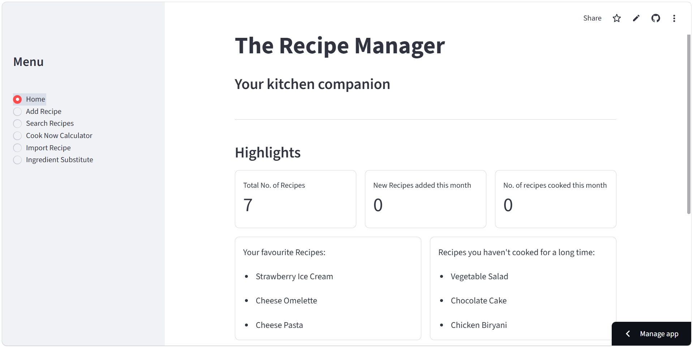

# Recipe Manager with API

A Streamlit recipe management application that allows users to manage recipes, search and filter their collection, generate shopping lists, and track their cooking activity.

The application also integrates an **external recipe API** to search and import recipes, as well as an **LLM API** to provide intelligent ingredient substitution suggestions based on the recipe being prepared.

## Features

- Add and manage recipes
- Search, filter, and sort recipes
- Generate shopping lists based on serving size
- Track recently cooked recipes
- Search and import recipes from an external API
- Get AI-powered ingredient substitution suggestions using an LLM

## Live App

[Open Recipe Manager](YOUR_STREAMLIT_LINK_HERE)

